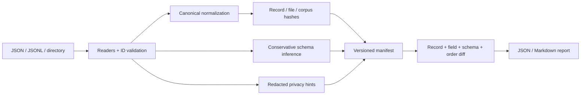

# CorpusLedger

[](https://github.com/appleweiping/corpusledger/actions/workflows/ci.yml)
[](https://github.com/appleweiping/corpusledger/actions/workflows/codeql.yml)
[](https://scorecard.dev/viewer/?uri=github.com/appleweiping/corpusledger)
[](https://github.com/appleweiping/corpusledger/releases)
[](https://www.python.org/)
[](LICENSE)

CorpusLedger creates reproducible, inspectable manifests for JSON and JSONL NLP corpora. It answers four practical
questions without uploading data or requiring a database:

1. Has the canonical JSON content of this corpus changed?
2. Which record IDs and fields changed?
3. Did the observed schema or record order drift?
4. Did a new field name or token-like value introduce a review-worthy privacy risk?

The core runtime has no third-party dependencies and supports Python 3.10–3.14. CorpusLedger is designed for dataset
release reviews, experiment inputs, annotation handoffs, and CI checks. Default JSONL snapshots process one raw record
at a time, and optional Ed25519 signatures authenticate exact manifest bytes. It reports evidence; it does not decide
whether a change is acceptable.

## Why content manifests?

File hashes are useful but too coarse for many corpus workflows. Reformatting JSON or reordering object keys should not
look like content edits. Splitting records across files does not change record or corpus hashes, although it can change
the explicitly separate file and observed-order metadata. Conversely, a one-field label change should be visible
without printing the underlying text. CorpusLedger normalizes each record, hashes content, stores per-field hashes,
and keeps order as a separate signal.

## Architecture



Normalization is locale-independent: object keys and strings are Unicode-normalized, keys are sorted, whitespace is
removed, and finite numbers remain numeric. Only strict JSON values are accepted; non-finite numbers and Python-only
types such as tuples, dates, and decimals fail clearly. List order is preserved unless the caller explicitly declares
lists set-like.

## Install

```bash
python -m pip install "git+https://github.com/appleweiping/corpusledger.git"
```

For an editable source checkout:

```bash
python -m pip install -e .
```

For development tooling:

```bash
python -m pip install -e ".[dev]"
```

Install the optional, standards-based signing support separately in production:

```bash
python -m pip install "corpusledger[signing]"
```

## Quick start

Create two manifests and compare them:

```bash
corpusledger snapshot examples/before.jsonl examples/out/before.manifest.json
corpusledger snapshot examples/after.jsonl examples/out/after.manifest.json
corpusledger diff examples/out/before.manifest.json examples/out/after.manifest.json
```

The checked example produces a report like this (hashes remain in the manifests):

```text
# CorpusLedger diff

**Changes:** yes
**Order changed:** yes
**Order-only change:** no

## Added records

- `doc-3`

## Changed records

- `doc-2`

## Schema drift

- Added fields: /metadata/reviewed
- Removed fields: none
```

The report is deliberately value-free. To create machine-readable output:

```bash
corpusledger diff examples/out/before.manifest.json examples/out/after.manifest.json --format json --output audit.json
```

Verify that a recorded source still matches every derived manifest section:

```bash
corpusledger verify examples/out/before.manifest.json
# or after moving the corpus:
corpusledger verify examples/out/before.manifest.json --input /datasets/release-7
```

Authenticate a manifest with a detached Ed25519 signature. The verifier receives the trusted public key out of band;
the signature envelope intentionally contains only its SHA-256 fingerprint, never key material:

```bash
openssl genpkey -algorithm Ed25519 -out release-private.pem
openssl pkey -in release-private.pem -pubout -out release-public.pem

corpusledger sign examples/out/before.manifest.json \
  --private-key release-private.pem --output examples/out/before.manifest.sig
corpusledger verify-signature examples/out/before.manifest.json \
  examples/out/before.manifest.sig --public-key release-public.pem
```

For an encrypted PEM key, pass the *name* of an environment variable with `--password-env`; never put the password on
the command line. CorpusLedger never writes private or public keys into a manifest or signature envelope.

Exit status is `0` for an unchanged diff or successful verification, `1` for detected changes, and `2` for invalid
input. Snapshot rejects duplicate IDs across all files in a directory. Its output is excluded when it sits inside the
input directory, and output paths may not overwrite—or hard-link to—their protected corpus, manifest, or key inputs.

## Input rules

- `.jsonl`: every non-empty line must be a JSON object.
- `.json`: a JSON array of objects or one object.
- directory: recursively includes `.json` and `.jsonl` files in relative-path order.
- each record must contain the ID field (`id` by default); IDs must be non-empty scalars and unique after string
  conversion and the configured Unicode normalization.
- JSON must be UTF-8, contain only Unicode scalar values, and contain no duplicate object keys or non-finite numeric
  extensions. Numbers use Python's finite binary64 semantics; integers are limited to 4,300 digits so behavior is stable
  across supported Python versions. Valid UTF-16 escape pairs normalize to their scalar value; unpaired surrogates fail.
  Malformed or ambiguous JSON includes the file and line/record position in its error.

Choose another identity field with `--id-field example_id`. Stable IDs are essential: changing an ID is intentionally
reported as one removal and one addition.

### Streaming boundary

`.jsonl` is the streaming source format: each line is parsed, normalized, scanned, summarized, and then discarded.
Memory still cannot be constant overall because the output itself contains one entry and field-hash map per record,
and global duplicate detection requires all normalized IDs. The precise lower bound is therefore
`O(manifest entries + unique IDs + schema paths + privacy findings + largest record)`, while raw corpus bodies are not
retained. A `.json` array is materialized by Python's standard JSON decoder. The opt-in `--sort-lists` policy also
retains canonical sequence members so v0.1 hashes remain compatible; use the default list-preserving policy for the
streaming path. See [architecture](docs/architecture.md) and the [reproducible benchmark](benchmarks/README.md).

### Language-neutral NDJSON gateway

The `NdjsonGateway` API and `corpusledger stream` command provide a bounded subprocess-friendly protocol. Each input
line is a JSON object with a `processor` name and object `payload`; each line receives exactly one compact JSON response,
including a structured error for malformed input. The CLI ships deterministic `identity` and `select` processors and
emits SHA-256 input/output digests plus success/failure counts to stderr (or `--report-output`):

```console
printf '%s\n' '{"processor":"select","payload":{"id":"a","text":"hello"}}' \
  | corpusledger stream --field id --strict
```

Use the Python API to register application-specific processors without giving the CLI arbitrary code execution:

```python
from corpusledger import NdjsonGateway

gateway = NdjsonGateway(max_line_bytes=1_048_576)
gateway.register("normalize", lambda payload: {"text": str(payload["text"]).strip()})
responses, report = gateway.process_lines(input_lines)
```

See [stream gateway](docs/stream.md) for the wire contract and failure semantics.

### Reader adapters

Built-in `.json` and `.jsonl` readers require no plugin. A reviewed package may expose another file reader under the
`corpusledger.readers` entry-point group:

```toml
[project.entry-points."corpusledger.readers"]
parquet = "my_corpus_adapter:ParquetReader"
```

The object implements the typed `ReaderAdapter` protocol (`name`, `version`, lowercase single-suffix `extensions`, and
`iter_records`). Load it explicitly with `snapshot --reader parquet`; CorpusLedger never auto-imports third-party
readers during discovery. The adapter name/version is persisted in `reader_metadata`, and verification refuses a
missing, different, or differently versioned adapter. Python callers may inject a reader object directly via
`build_manifest(..., reader=adapter)` without packaging an entry point. Adapter identity metadata rejects surrounding
whitespace, control/format characters, and surrogate code points. Discovery and imports execute trusted installed code
only after selection; error messages expose the failure type without echoing arbitrary plugin exception text.

## Python API

```python
from corpusledger import Manifest, build_manifest, compare

before = build_manifest("corpus-v1", id_field="example_id")
before.save("v1.manifest.json")

after = build_manifest("corpus-v2", id_field="example_id")
result = compare(before, after)

print(result.added_records)
print(result.changed_records["sample-42"]["fields"])
```

The public normalization API is also available:

```python
from corpusledger import CanonicalPolicy, canonical_json

canonical_json({"text": "cafe\u0301"})
canonical_json(["b", "a"], CanonicalPolicy(list_strategy="sort"))
```

Sorting lists changes semantics for sequence data. Use it only for fields you know are set-like; the current policy is
corpus-wide and is recorded in the manifest.

The iterator API is available when a pipeline needs validated records without constructing a manifest:

```python
from corpusledger import iter_corpus

for record in iter_corpus("large-corpus.jsonl"):
    consume(record.record_id, record.data)
```

## What a manifest contains

- format and normalization version;
- hash algorithm and complete canonicalization policy;
- privacy scanner version and complete scanner configuration;
- optional, explicit reader adapter identity/version;
- order-independent corpus hash and separate order hash;
- logical file hashes;
- record hash, source, position, and per-field hashes;
- observed field presence, types, nullability, list item types, and object keys;
- redacted privacy-risk hints.

Field and finding paths use RFC 6901 JSON Pointer. For example, `/metadata/reviewed` is an object member while
`/metadata.reviewed` is a literal top-level key; the two cannot collide.

See [manifest format](docs/manifest-format.md) for compatibility rules and [architecture](docs/architecture.md) for
design trade-offs.

## Privacy and threat model

CorpusLedger runs locally and opens only input JSON/JSONL files selected by the user. The privacy scanner examines
values already read as corpus records. It does not inspect environment variables, keychains, home directories, Git
history, network endpoints, or unrelated files.

Sensitive field-name matching and high-entropy token detection are heuristics. A finding contains record ID, field path,
length/entropy where relevant, and a short SHA-256 evidence hash—never the full suspected secret. False positives and
false negatives are expected. Manifests can still reveal field names, record IDs, record counts, source paths, and
change patterns, so treat them according to your data-governance policy.

Hashes are integrity indicators, not encryption, authentication, or proof of authorship. Low-entropy values can be
guessed by an attacker who has a manifest and a small candidate set.

Detached Ed25519 signatures add authenticity only when the verifier obtains the expected public key through a trusted
channel. A valid signature does not make privacy findings complete, make the underlying corpus available, or establish
that the signer approved its semantic quality. Signature envelopes bind exact manifest bytes; even harmless whitespace
changes require a new signature. See [the security policy](SECURITY.md) for key-handling and trust guidance.

The corpus, order, record, and file hashes are reproducible across machines. The manifest also records an absolute
`source` path so verification works without extra arguments on the creating machine; consequently, complete manifest
bytes differ when the same corpus is snapshotted at another location. Use `verify --input` after moving a corpus.

## Non-goals

- parsing CSV, Parquet, archives, or remote object stores;
- validating against a user-authored JSON Schema;
- detecting all personal data or credentials;
- anonymizing, redacting, repairing, or transforming the corpus;
- trusted timestamps, transparency logs, or public-key distribution;
- estimating model or annotation quality;
- claiming two reordered lists are equivalent by default.

## Development

```bash
python -m pytest
python -m coverage run -m pytest
python -m coverage report
python -m ruff check .
python -m mypy
python -m build
```

Tests cover deterministic Unicode normalization, property-based canonicalization/roundtrips, streaming-vs-v0.1 hash
compatibility, adapters, Unicode-equivalent and duplicate IDs, duplicate JSON keys, schema drift, collision-free field
paths, order-only changes, privacy redaction/configuration, strict manifest loading, full verification, Ed25519
tampering/key mismatch, and CLI exit behavior. CI tests and builds distributions on Python 3.10–3.14, with packaged
wheel smoke tests on Linux, Windows, and macOS.

## Roadmap

- per-field list-order policies with an external-sort implementation;
- bounded-size or external manifest indexes for corpora whose manifest metadata itself exceeds memory;
- optional JSON Schema export and compatibility modes;
- Sigstore-compatible keyless attestations and transparency-log integration;
- configurable path exclusion and privacy rule packs;
- maintained adapters for columnar and remote object-store formats in separate packages.

## License and security

CorpusLedger is available under the [MIT License](LICENSE). Please report vulnerabilities according to
[SECURITY.md](SECURITY.md), and read [CONTRIBUTING.md](CONTRIBUTING.md) before proposing a change.
