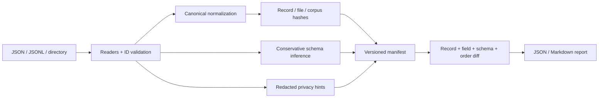

# CorpusLedger

[](https://github.com/appleweiping/corpusledger/actions/workflows/ci.yml)
[](https://www.python.org/)
[](LICENSE)

CorpusLedger creates reproducible, inspectable manifests for JSON and JSONL NLP corpora. It answers four practical
questions without uploading data or requiring a database:

1. Has the canonical JSON content of this corpus changed?
2. Which record IDs and fields changed?
3. Did the observed schema or record order drift?
4. Did a new field name or token-like value introduce a review-worthy privacy risk?

The runtime has no third-party dependencies and supports Python 3.10–3.13. CorpusLedger is designed for dataset
release reviews, experiment inputs, annotation handoffs, and CI checks. It reports evidence; it does not decide whether
a change is acceptable.

## Why content manifests?

File hashes are useful but too coarse for many corpus workflows. Reformatting JSON or reordering object keys should not
look like content edits. Splitting records across files does not change record or corpus hashes, although it can change
the explicitly separate file and observed-order metadata. Conversely, a one-field label change should be visible
without printing the underlying text. CorpusLedger normalizes each record, hashes content, stores per-field hashes,
and keeps order as a separate signal.

## Architecture



Normalization is locale-independent: object keys and strings are Unicode-normalized, keys are sorted, whitespace is
removed, and finite numbers remain numeric. Only strict JSON values are accepted; non-finite numbers and Python-only
types such as tuples, dates, and decimals fail clearly. List order is preserved unless the caller explicitly declares
lists set-like.

## Install

```bash
python -m pip install "git+https://github.com/appleweiping/corpusledger.git"
```

For an editable source checkout:

```bash
python -m pip install -e .
```

For development tooling:

```bash
python -m pip install -e ".[dev]"
```

## Quick start

Create two manifests and compare them:

```bash
corpusledger snapshot examples/before.jsonl examples/out/before.manifest.json
corpusledger snapshot examples/after.jsonl examples/out/after.manifest.json
corpusledger diff examples/out/before.manifest.json examples/out/after.manifest.json
```

The checked example produces a report like this (hashes remain in the manifests):

```text
# CorpusLedger diff

**Changes:** yes
**Order changed:** yes
**Order-only change:** no

## Added records

- `doc-3`

## Changed records

- `doc-2`

## Schema drift

- Added fields: /metadata/reviewed
- Removed fields: none
```

The report is deliberately value-free. To create machine-readable output:

```bash
corpusledger diff examples/out/before.manifest.json examples/out/after.manifest.json --format json --output audit.json
```

Verify that a recorded source still matches every derived manifest section:

```bash
corpusledger verify examples/out/before.manifest.json
# or after moving the corpus:
corpusledger verify examples/out/before.manifest.json --input /datasets/release-7
```

Exit status is `0` for an unchanged diff or successful verification, `1` for detected changes, and `2` for invalid
input. Snapshot rejects duplicate IDs across all files in a directory. Its output is excluded when it sits inside the
input directory, and an output path may not overwrite the input corpus file.

## Input rules

- `.jsonl`: every non-empty line must be a JSON object.
- `.json`: a JSON array of objects or one object.
- directory: recursively includes `.json` and `.jsonl` files in relative-path order.
- each record must contain the ID field (`id` by default); IDs must be non-empty scalars and unique after string
  conversion and the configured Unicode normalization.
- JSON must be UTF-8 and contain no duplicate object keys or non-finite numeric extensions. Malformed or ambiguous JSON
  includes the file and line/record position in its error.

Choose another identity field with `--id-field example_id`. Stable IDs are essential: changing an ID is intentionally
reported as one removal and one addition.

## Python API

```python
from corpusledger import Manifest, build_manifest, compare

before = build_manifest("corpus-v1", id_field="example_id")
before.save("v1.manifest.json")

after = build_manifest("corpus-v2", id_field="example_id")
result = compare(before, after)

print(result.added_records)
print(result.changed_records["sample-42"]["fields"])
```

The public normalization API is also available:

```python
from corpusledger import CanonicalPolicy, canonical_json

canonical_json({"text": "cafe\u0301"})
canonical_json(["b", "a"], CanonicalPolicy(list_strategy="sort"))
```

Sorting lists changes semantics for sequence data. Use it only for fields you know are set-like; the current policy is
corpus-wide and is recorded in the manifest.

## What a manifest contains

- format and normalization version;
- hash algorithm and complete canonicalization policy;
- privacy scanner version and complete scanner configuration;
- order-independent corpus hash and separate order hash;
- logical file hashes;
- record hash, source, position, and per-field hashes;
- observed field presence, types, nullability, list item types, and object keys;
- redacted privacy-risk hints.

Field and finding paths use RFC 6901 JSON Pointer. For example, `/metadata/reviewed` is an object member while
`/metadata.reviewed` is a literal top-level key; the two cannot collide.

See [manifest format](docs/manifest-format.md) for compatibility rules and [architecture](docs/architecture.md) for
design trade-offs.

## Privacy and threat model

CorpusLedger runs locally and opens only input JSON/JSONL files selected by the user. The privacy scanner examines
values already read as corpus records. It does not inspect environment variables, keychains, home directories, Git
history, network endpoints, or unrelated files.

Sensitive field-name matching and high-entropy token detection are heuristics. A finding contains record ID, field path,
length/entropy where relevant, and a short SHA-256 evidence hash—never the full suspected secret. False positives and
false negatives are expected. Manifests can still reveal field names, record IDs, record counts, source paths, and
change patterns, so treat them according to your data-governance policy.

Hashes are integrity indicators, not encryption, authentication, or proof of authorship. Low-entropy values can be
guessed by an attacker who has a manifest and a small candidate set.

The corpus, order, record, and file hashes are reproducible across machines. The manifest also records an absolute
`source` path so verification works without extra arguments on the creating machine; consequently, complete manifest
bytes differ when the same corpus is snapshotted at another location. Use `verify --input` after moving a corpus.

## Non-goals

- parsing CSV, Parquet, archives, or remote object stores;
- validating against a user-authored JSON Schema;
- detecting all personal data or credentials;
- anonymizing, redacting, repairing, or transforming the corpus;
- cryptographic signing or trusted timestamps;
- estimating model or annotation quality;
- claiming two reordered lists are equivalent by default.

## Development

```bash
python -m pytest
python -m coverage run -m pytest
python -m coverage report
python -m ruff check .
python -m mypy
python -m build
```

Tests cover deterministic Unicode normalization, Unicode-equivalent and duplicate IDs, duplicate JSON keys, schema
drift, collision-free field paths, order-only changes, privacy redaction/configuration, strict manifest loading, full
verification, and CLI exit behavior. CI tests and builds distributions on Python 3.10–3.13.

## Roadmap

- per-field list-order policies;
- streaming manifest construction for corpora larger than memory;
- optional JSON Schema export and compatibility modes;
- signed manifests and trusted release attestations;
- configurable path exclusion and privacy rule packs;
- adapters for columnar formats in optional packages.

## License and security

CorpusLedger is available under the [MIT License](LICENSE). Please report vulnerabilities according to
[SECURITY.md](SECURITY.md), and read [CONTRIBUTING.md](CONTRIBUTING.md) before proposing a change.
